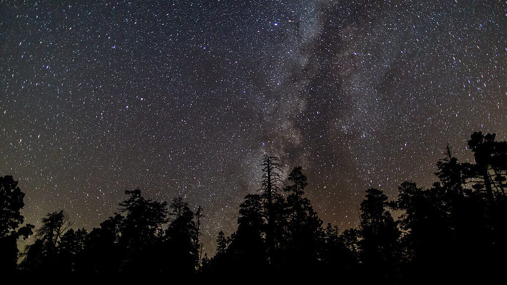
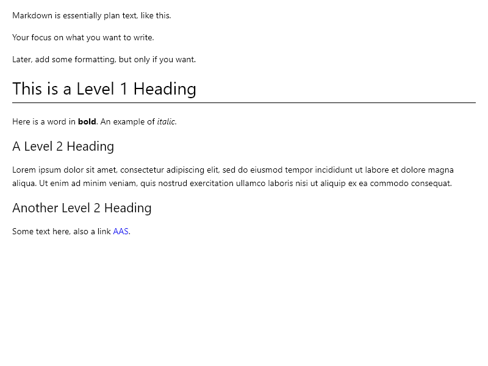

# Using Markdown to Make Notes and Create Diagrams

## Helping the Observer



---

## Making Notes Can Be a Challenge Sometimes

- Pen and paper, so nice, but hard to... share / search / edit / backup.
- Proprietary software... learning curve / compatibility / restricted formats.

---

## Why Use Markdown for Notes?

* **Simplicity**: Easy to learn, essentially plain text.
* **Portability**: Works on any platform.
* **Flexibility**: Convert to various formats (PDF, Word, epub...).

---

## Example
```text
Markdown is essentially plan text, like this.

Your focus on what you want to write.

Later, add some formatting, but only if you want.

# This is a Level 1 Heading
Here is a word in **bold**. An example of *italic*.

## A Level 2 Heading
Lorem ipsum dolor sit amet, consectetur adipiscing
elit, sed do eiusmod tempor incididunt ut labore et
dolore magna aliqua. Ut enim ad minim veniam, quis
nostrud exercitation ullamco laboris nisi ut aliquip
ex ea commodo consequat.

## Another Level 2 Heading
Some text here, also a link [AAS](https://andoverastronomy.org.uk/).
```

---



---

## Include $\LaTeX$ Notation

```latex
$$
\int_{-\infty}^{\infty} e^{-x^2} \, dx = \sqrt{\pi}
$$
```

Produces:

$$
\int_{-\infty}^{\infty} e^{-x^2} \, dx = \sqrt{\pi}
$$

---

## Create Diagrams From Text

```text
flowchart
    A --> B
    A --> C
    A --> D
```

---

## Create Diagrams From Text

<script type="module">
  import mermaid from 'https://cdn.jsdelivr.net/npm/mermaid@10/dist/mermaid.esm.min.mjs';
  mermaid.initialize({ startOnLoad: true });
</script>

<div class="mermaid">
flowchart
    A --> B
    A --> C
    A --> D
</div>

---

## Charts

<div class="mermaid">
gantt
    title Astronomical Events and Observations Plan (Jan-Apr 2025)
    dateFormat YYYY-MM-DD
    section Key Astronomical Events
        Quadrantids Meteor Shower    :active, ev1, 2025-01-03, 2d
        Venus Good viewing           :ev2, 2025-01-10, 1d
        Lunar Eclipse                :ev3, 2025-03-14, 1d
        Partial Solar Eclipse        :ev4, 2025-03-29, 1d
        Lyrids Meteor Shower         :ev6, 2025-04-22, 2d
    section Constraints
        Full Moon (Jan)              :milestone, fm1, 2025-01-13, 1d
        Full Moon (Feb)              :milestone, fm2, 2025-02-12, 1d
        Full Moon (Mar)              :milestone, fm3, 2025-03-13, 1d
        Full Moon (Apr)              :milestone, fm3, 2025-04-13, 1d
</div>

---

## One Source, Many Outputs

The same Markdown file can be used to generate different outputs:

* PDF
* Word
* Presentation
* Website
* E-book
