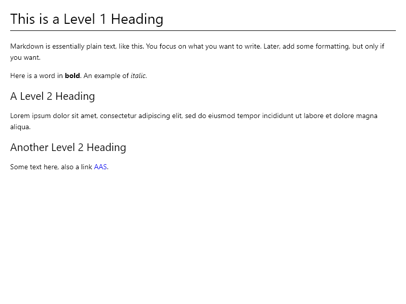

# Using Markdown to Make Notes and Create Diagrams

## Helping the Observer


---

## Making Notes Can Be a Challenge Sometimes

- Pen and paper, super nice, but hard to... search / edit / backup / share.
- Proprietary software... learning curve / compatibility / restricted formats.

---

## Why Use Markdown for Notes?

* **Simplicity**: Easy to learn, it is essentially plain text.
* **Portability**: Works on any platform.
* **Flexibility**: Convert to many formats (PDF, Word, epub...).

---

## Example
```text
# This is a Level 1 Heading
Markdown is essentially plain text, like this.
You focus on what you want to write.
Later, add some formatting, but only if you want.

Here is a word in **bold** and an example of *italic*.

## A Level 2 Heading
Lorem ipsum dolor sit amet, consectetur adipiscing
elit, sed do eiusmod tempor incididunt ut labore et
dolore magna aliqua. 

## Another Level 2 Heading
Some text here, also a link [AAS](https://andoverastronomy.org.uk/).
```

---



---

## Include $\LaTeX$ Notation

```latex
$$
\int_{-\infty}^{\infty} e^{-x^2} \, dx = \sqrt{\pi}
$$
```

Produces:

$$
\int_{-\infty}^{\infty} e^{-x^2} \, dx = \sqrt{\pi}
$$

---

## Create Diagrams From Text

```text
flowchart TD
    A[Start] --> B{Is it?}
    B -- Yes --> C[OK]
    C --> D[Rethink]
    D --> B
    B -- No ----> E[End]
```

---

<script type="module">
  import mermaid from 'https://cdn.jsdelivr.net/npm/mermaid@10/dist/mermaid.esm.min.mjs';
  mermaid.initialize({ startOnLoad: true });
</script>

<div class="mermaid">
flowchart TD
    A[Start] --> B{Is it?}
    B -- Yes --> C[OK]
    C --> D[Rethink]
    D --> B
    B -- No ----> E[End]
</div>

---

```text
pie title Pets adopted by volunteers
    "Dogs" : 386
    "Cats" : 85
    "Rats" : 15
```

<div class="mermaid">
pie title Pets adopted by volunteers
    "Dogs" : 386
    "Cats" : 85
    "Rats" : 15
</div>

---

## Charts

```text
gantt
    title Astronomical Events and Full Moon Dates (Dec 2024 - Apr 2025)
    dateFormat  YYYY-MM-DD
    section Full Moon Periods
        Cold Moon Block        :blocked1, 2024-12-13, 5d
        Wolf Moon Block        :blocked2, 2025-01-11, 5d
        Snow Moon Block        :blocked3, 2025-02-10, 5d
        Worm Moon Block        :blocked4, 2025-03-12, 5d
        Pink Moon Block        :blocked5, 2025-04-11, 5d
    
    section Meteor Showers
        Geminids Peak          :ms1, 2024-12-13, 2d
        Ursids Peak            :ms2, 2024-12-22, 2d
        Quadrantids Peak       :ms3, 2025-01-04, 1d
        Lyrids Peak            :ms4, 2025-04-22, 2d
    
    section Planetary Events
        Jupiter at Opposition  :pe1, 2024-12-07, 1d
        Mars at Opposition     :pe2, 2025-01-16, 1d
        Planetary Alignment    :pe3, 2025-02-28, 1d
    
    section Eclipses and Solstices
        December Solstice      :solstice, 2024-12-21, 1d
        Total Lunar Eclipse    :eclipse, 2025-03-14, 1d
        March Equinox          :equinox, 2025-03-20, 1d
```

---

## Charts

<div class="mermaid">
gantt
    title Astronomical Events and Full Moon Dates (Dec 2024 - Apr 2025)
    dateFormat  YYYY-MM-DD
    section Full Moon Periods
      Cold Moon Block        :blocked1, 2024-12-13, 5d
      Wolf Moon Block        :blocked2, 2025-01-11, 5d
      Snow Moon Block        :blocked3, 2025-02-10, 5d
      Worm Moon Block        :blocked4, 2025-03-12, 5d
      Pink Moon Block        :blocked5, 2025-04-11, 5d
    section Meteor Showers
      Geminids Peak          :ms1, 2024-12-13, 2d
      Ursids Peak            :ms2, 2024-12-22, 2d
      Quadrantids Peak       :ms3, 2025-01-04, 1d
      Lyrids Peak            :ms4, 2025-04-22, 2d
    section Planetary Events
      Jupiter at Opposition  :pe1, 2024-12-07, 1d
      Mars at Opposition     :pe2, 2025-01-16, 1d
      Planetary Alignment    :pe3, 2025-02-28, 1d
    section Eclipses and Solstices
      December Solstice      :solstice, 2024-12-21, 1d
      Total Lunar Eclipse    :eclipse, 2025-03-14, 1d
      March Equinox          :equinox, 2025-03-20, 1d
</div>

---

## One Source, Many Outputs

The same Markdown file can be used to generate different outputs:

* PDF
* Word
* Presentation
* Website
* E-book

---

## Getting Started

1. Install a Markdown editor: Notepad, VS Code, Obsidian.
2. Learn the basics of Markdown.
3. Add maths, tables, diagrams, charts.
4. Export to your notes to desired format(s).